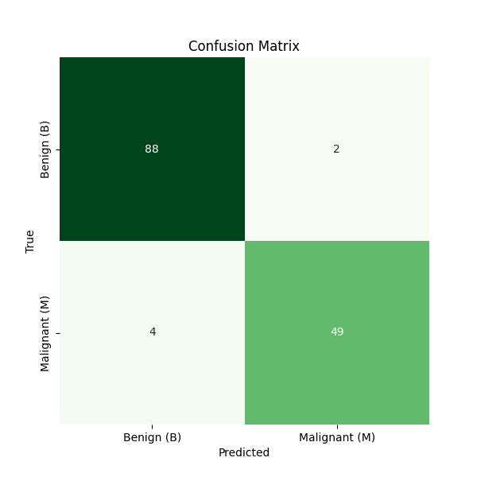

# Breast cancer prediction

The Breast Cancer Prediction API is a Flask-based web service that provides a simple interface to predict whether a given set of features is indicative of benign or malignant breast cancer. The API utilizes a machine learning model trained on a breast cancer dataset to make predictions.

## Machine learning model
The predictive model is built using the Random Forest Classifier, trained on the well-known Breast Cancer Wisconsin (Diagnostic) Dataset. The model has undergone rigorous testing and validation to ensure reliable predictions.

### Confusion Matrix Evaluation
The confusion matrix plot provides a concise snapshot of our breast cancer prediction model's performance in distinguishing between Benign (B) and Malignant (M) cases. It showcases True Positives, True Negatives, False Positives, and False Negatives, offering a quick assessment of the model's accuracy in classifying different types of breast cancer. This visual aid is instrumental in gauging the model's reliability and precision in clinical scenarios.


<div align="center">
  
</div>


## Installation

**1** -  Clone this repository to your machine by running

```bash
cd https://github.com/hamza-hadj-aissa/breast_cancer_prediction.git
```

**2** - Navigate to the project's directory
```
cd breast_cancer_prediction/
```

**3** - Set Up a Virtual Environment
```
python -m venv env
```

**4** - Activate the Virtual Environment
```
source env/bin/activate
```

**5** - Install required libraries
```bash
pip install -r requirements.txt
```

**6** - Run the Flask API
```bash
python main.py
```
This will server the API on : http://localhost:8000


## API Reference

#### Predict cancer

```http
  POST /predict
```

| Parameter | Type     | Description                |
| :-------- | :------- | :------------------------- |
| `radius_mean` | `float` | **Required**. Radius of the mean nuclei |
| `texture_mean` | `float` | **Required**.Texture of the mean nuclei |
| `smoothness_mean` | `float` | **Required**. Smoothness of the mean nuclei|
| `symmetry_mean` | `float` | **Required**.  Symmetry of the mean nuclei|
| `fractal_dimension_mean` | `float` | **Required**. Fractal dimension of the mean nuclei |
| `texture_se` | `float` | **Required**. Standard error of texture |
| `smoothness_se` | `float` | **Required**. Standard error of smoothness |
| `symmetry_se` | `float` | **Required**. Standard error of symmetry |

* Response is a JSON object. Example: 
```
{
  "prediction": [
    {"Benign": 0.8},
    {"Malignant": 0.2}
  ]
}
```


## Next.js UI Repository

The Next.js user interface for breast cancer prediction is available on GitHub. You can find the source code and project details in the following repository:

- **Repository:** [breast_cancer_prediction Web App](https://github.com/hamza-hadj-aissa/breast_cancer_prediction_ui)

### Getting Started

To integrate the Next.js UI with the Breast Cancer Prediction API, follow these steps:

1. Clone the Next.js UI repository:

```bash
git clone https://github.com/hamza-hadj-aissa/breast_cancer_prediction_ui.git
```

2. Navigate to the project directory:
```
cd breast_cancer_prediction_ui
```
3. Install dependencies:
```
npm install
```
4. Run the Next.js app:
```
npm run dev
```
This will start the development server, and you can access the app at http://localhost:3000.


